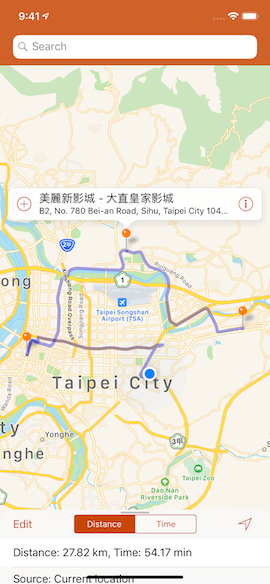
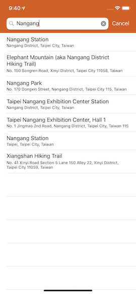
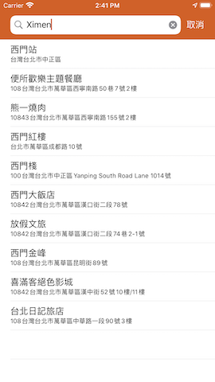

# SalesTraveling

# 

這是一個透過 Apple API 計算路徑的 App 服務。(https://developer.apple.com/documentation/mapkit/mkdirections)

試想從你的所在位置，要怎麼走才能最快繞完以下的地方

--------

台北 101

淡水老街

內湖美麗華

陽明山

基隆夜市

--------

透過窮舉法，簡單的計算各種路線的最短路線/最快路線。

\- 適合旅遊之前的估算規劃

\- 適合送貨之前的最短路線

\- 適合超過5個以上目的地的路徑規劃

特別感謝：

App icon: 周子棋

iOS develop: 郭佳甯, 陳穎璿、喵仔閒聊群

Feature: 徐仲威, 傅勻垣

Bug: 姜惟傑, 陳知言

目前已在 App store 上架：

https://apps.apple.com/tw/app/shodo/id1406118779